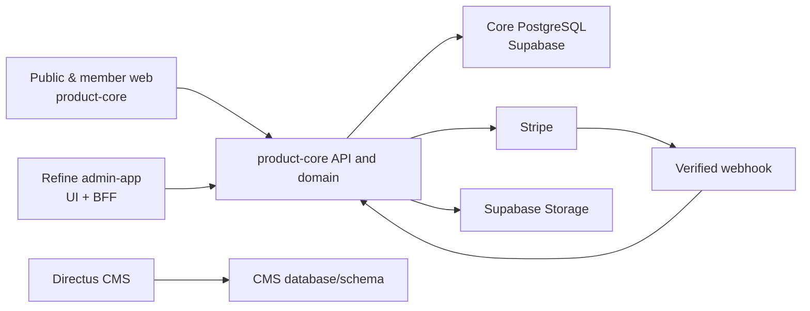

# Architecture

## Decision summary

KYLYVNYK CLUB is a TypeScript strict modular monolith in a `pnpm` + Turborepo workspace. PostgreSQL is the core source of truth. The architecture privileges explicit domain ownership and testable command flows over framework magic.

## Workspace ownership

| Area                  | Owns                                                                                                                 | Must not own                                                  |
| --------------------- | -------------------------------------------------------------------------------------------------------------------- | ------------------------------------------------------------- |
| `apps/product-core`   | public/member web, API, authentication decisions, domain commands, Prisma runtime access, webhooks, cron/jobs, audit | admin visual workflows, CMS authoring                         |
| `apps/admin-app`      | Refine operational UX, staff session shell, product-core API proxy/client                                            | Prisma, database credentials, Stripe secrets, business rules  |
| `packages/domain`     | pure state transitions, policies, permissions, invariants                                                            | I/O, framework imports                                        |
| `packages/contracts`  | versioned DTOs, API shapes, enums                                                                                    | database implementation                                       |
| `packages/validation` | Zod boundary schemas                                                                                                 | side effects                                                  |
| `packages/database`   | Prisma schema, migrations, generated-client configuration, seeds                                                     | application decisions                                         |
| `packages/ui`         | tokens and reusable presentational primitives                                                                        | business logic and feature-specific API calls                 |
| Directus              | CMS pages, FAQ, legal, SEO, translations, media                                                                      | membership, cards, payments, staff, audit, core-domain writes |

## Command flow

Every significant mutation follows one route: `typed request -> validation -> authentication -> permission -> service command -> transaction/repository -> audit/domain event -> typed response`. A route handler, React component, Directus Flow, and Prisma middleware may not become an alternative place for domain policy.

## Module model

Core modules are Identity, Membership, Cards, Partners, Offers, Introductions, Billing, Support, Notifications, Content Integration, and Platform/Audit. A module exports contracts and services, never raw tables. Cross-module behavior calls exported commands or handles explicit domain events.

## Access model

Roles are presets only. Authoritative access is permission-based and checked server-side on every API route and command. The initial roles are `OWNER`, `ADMIN`, `MODERATOR`, `SUPPORT`, `FINANCE`, and `CONTENT_MANAGER`.

## Deployment model

Development, staging, and production are isolated. Each production deployment is an immutable Vercel build; migrations are a separately approved CI release step. Staging and production use separate Supabase and Stripe configurations. No application build applies schema changes automatically.
